# Cab Booking App (Java + AWS Lambda + Bootstrap)

A complete serverless ride-sharing application built with Java, AWS Lambda, API Gateway, RDS, and Bootstrap frontend hosted on S3.

**Live Frontend:** [http://cab-booking-app-frontend.s3-website.ap-south-1.amazonaws.com/](http://cab-booking-app-frontend.s3-website.ap-south-1.amazonaws.com/)

---

## Architecture Overview

```mermaid
graph TB
    User["👤 User Browser"]
    S3["📦 S3 Static Hosting<br/>(Frontend)"]
    APIGW["🚪 API Gateway<br/>(REST API)"]
    Lambda["⚡ Lambda<br/>(Java 17)"]
    RDS["🗄️ RDS MySQL<br/>(cab_booking_db)"]
    
    User -->|HTTPS| S3
    User -->|API Calls| APIGW
    APIGW -->|Proxy Integration| Lambda
    Lambda -->|TCP 3306| RDS
    S3 -->|Embedded API URL| S3
    
    style User fill:#e1f5ff
    style S3 fill:#fff3e0
    style APIGW fill:#f3e5f5
    style Lambda fill:#e8f5e9
    style RDS fill:#fce4ec
```



### Component Details

| Component | Purpose | Technology |
|-----------|---------|-----------|
| **Frontend** | User interface for booking/publishing rides | Bootstrap 5, Vanilla JS, HTML |
| **API Gateway** | REST endpoint for all backend operations | AWS REST API with proxy integration |
| **Lambda** | Business logic & database interaction | Java 17, Stateless handler |
| **RDS MySQL** | Persistent storage for users, rides, bookings | AWS RDS in VPC |

---

## Thought Process & Design Decisions

### 1. **Microservice-First Architecture**
- Chose Lambda over EC2 to avoid server management and reduce costs
- Each request is stateless, allowing auto-scaling
- No need to manage deployment infrastructure

### 2. **Database Design**
- Three main tables: `users`, `rides`, `bookings`
- Foreign keys ensure referential integrity
- Auto-generated IDs for simplified tracking
- Timestamps for audit trails

### 3. **Transaction Safety**
- Booking operations use database transactions to prevent race conditions
- When a user books a ride, seats are atomically reduced
- If booking fails, seats are rolled back—no inconsistency

### 4. **REST API Pattern**
- Standard HTTP verbs: GET (fetch), POST (create), DELETE (remove)
- Query params for optional filtering (e.g., search by source/destination)
- Standard JSON responses with CORS enabled

### 5. **Frontend Isolation**
- API URL locked in `config.js` at build time (S3 hosting)
- No manual URL input field required for users
- Local storage only used for future session persistence (optional)

### 6. **Environment Configuration**
- `.env` file for local development (ignored by git)
- Lambda env vars for AWS deployment
- Fallback defaults to prevent hard failures

---

## Challenges Faced & Solutions

### Challenge 1: **Lambda Java Packaging**
**Problem:** Initial Lambda zip had `function.jar` nested inside, causing `Class not found` error.
- Lambda couldn't find `api.LambdaHandler` because it was looking at the zip root, not inside a nested jar

**Solution:** Modified packaging script to extract fat jar contents into zip root
- Now `lambda_pkg.zip` contains classes and dependencies directly at root level
- Lambda classpath can now discover all compiled classes

### Challenge 2: **Database Connectivity from Lambda**
**Problem:** Lambda kept hitting "Database error: Failed to initialize schema" even with correct env vars

**Solution:** Multi-step debugging:
1. Moved `/health` endpoint before DB initialization (to separate network issues from code issues)
2. Verified Lambda security group had inbound MySQL access to RDS
3. Ensured Lambda was in same VPC as RDS
4. Fixed typo in `DB_PASS` env var (had `DB_PASS=` prefix in value)
5. Confirmed RDS `cab_booking` database existed

### Challenge 3: **API Gateway Path Routing**
**Problem:** API Gateway wasn't sending HTTP method/path to Lambda handler

**Solution:** Enabled **Lambda Proxy Integration** 
- REST API requires explicit proxy integration toggle
- Once enabled, Lambda receives full `APIGatewayProxyRequestEvent` with method, path, headers, body
- Without it, Lambda receives old format without path information

### Challenge 4: **Frontend API Configuration**
**Problem:** Frontend input field for API URL could be incorrectly changed by users

**Solution:** Removed UI input field and locked API URL to `config.js`
- URL set at build time, not runtime
- Users cannot accidentally point frontend to wrong API
- Still supports localhost for development

### Challenge 5: **Git Repository Size**
**Problem:** Maven build artifacts and compiled classes added 3,000+ files to git

**Solution:** Enhanced `.gitignore`
- Added `/target/`
- Excluded `*.jar`, `*.class`, build artifacts
- Removed cached files from tracking with `git rm --cached`

---

## Backend Overview

- Runtime: Java 17
- Handler: `api.LambdaHandler`
- Build: Maven shaded JAR (`target/cab-booking-lambda.jar`)
- Database: MySQL-compatible RDS (env-based configuration)

### API Endpoints

- `GET /health` — Health check
- `POST /users/register` body: `{ "name": "...", "email": "..." }`
- `GET /users/login?email=...`
- `POST /rides` body: `{ "ownerId": 1, "source": "A", "destination": "B", "seats": 3, "farePerSeat": 200 }`
- `GET /rides` — List all available rides
- `GET /rides?source=A&destination=B` — Search rides by route
- `DELETE /rides/{rideId}?ownerId=1` — Cancel a ride
- `POST /bookings` body: `{ "rideId": 1, "userId": 2, "seats": 1 }`
- `GET /bookings/{userId}` — View user's bookings
- `DELETE /bookings/{bookingId}?userId=2` — Cancel a booking

## Environment Variables

Set these in Lambda configuration:

- `DB_HOST` — RDS endpoint
- `DB_PORT` — Default: `3306`
- `DB_NAME` — Default: `cab_booking`
- `DB_USER` — Database username
- `DB_PASS` — Database password

For local development, use `.env` file in project root:

```bash
DB_HOST=cab-booking-db.c904uaymsnn9.ap-south-1.rds.amazonaws.com
DB_PORT=3306
DB_NAME=cab_booking
DB_USER=admin
DB_PASS=<your-password>
```

Lookup order:
1. OS environment variables (Lambda)
2. `.env` file values (local dev)
3. Code defaults

## Build

```bash
mvn clean package
```

## Build ZIP for Lambda Upload

```bash
./scripts/build_lambda_zip.sh
```

Outputs:
- `lambda_pkg/` — Extracted classes and dependencies
- `lambda_pkg.zip` — Ready for Lambda upload

Lambda Console settings:
- Runtime: `Java 17`
- Handler: `api.LambdaHandler::handleRequest`

## AWS Lambda + API Gateway Setup

1. Create Lambda function (Java 17)
2. Upload `lambda_pkg.zip` via Lambda Console
3. Set handler to: `api.LambdaHandler::handleRequest`
4. Add environment variables (`DB_HOST`, `DB_PORT`, `DB_NAME`, `DB_USER`, `DB_PASS`)
5. Create REST API in API Gateway
6. Add resource `/{proxy+}` with `ANY` method
7. **Enable Lambda Proxy Integration** on the method
8. Deploy to stage (e.g., `prod`)
9. Note the invoke URL (e.g., `https://8wl89zpued.execute-api.ap-south-1.amazonaws.com/prod`)

## Frontend (S3 Static Hosting)

Frontend lives in `frontend/` with Bootstrap assets in `frontend/assets/`.

**Deployment:**

1. Update `frontend/config.js`:

```js
window.CAB_CONFIG = {
    apiBaseUrl: "https://<your-api-id>.execute-api.<region>.amazonaws.com/<stage>"
};
```

2. Create S3 bucket
3. Upload entire `frontend/` folder
4. Enable **Static website hosting** in bucket properties
5. Set index document to `index.html`
6. Configure bucket policy for public access if needed

**Live Site:** [http://cab-booking-app-frontend.s3-website.ap-south-1.amazonaws.com/](http://cab-booking-app-frontend.s3-website.ap-south-1.amazonaws.com/)

## Local Testing

### Backend

```bash
mvn clean package
java -cp target/cab-booking-lambda.jar Main
```

### Frontend

```bash
cd frontend
python3 -m http.server 5500
# Open http://localhost:5500
```

## Project Structure

```
.
├── src/
│   ├── api/
│   │   └── LambdaHandler.java       # AWS Lambda entry point
│   ├── db/
│   │   └── DBConnection.java        # RDS connectivity + schema init
│   ├── dao/
│   │   ├── UserDAO.java
│   │   ├── RideDAO.java
│   │   └── BookingDAO.java
│   ├── model/
│   │   ├── User.java
│   │   ├── Ride.java
│   │   └── Booking.java
│   ├── service/
│   │   ├── UserService.java
│   │   ├── RideService.java
│   │   └── BookingService.java
│   └── Main.java
├── frontend/
│   ├── index.html                   # Primary UI
│   ├── app.js                       # Business logic
│   ├── styles.css                   # Custom styles
│   ├── config.js                    # API configuration
│   └── assets/
│       ├── css/                     # Bootstrap CSS
│       └── js/                      # Bootstrap JS
├── scripts/
│   └── build_lambda_zip.sh          # Zero-config deployment script
├── pom.xml                          # Maven build config
├── .env                             # Local DB credentials (git-ignored)
├── .env.example                     # Template for .env
└── README.md                        # This file
```

## Key Takeaways

✅ **Fully Serverless:** No servers to manage, auto-scaling out of the box  
✅ **Transaction-Safe:** Race condition prevention via database transactions  
✅ **Environment-Agnostic:** Works locally with `.env`, on Lambda with env vars  
✅ **Frontend Decoupled:** S3 hosting completely independent of backend  
✅ **Single Packaging:** One script builds and prepares deployment  
✅ **Bootstrap UI:** Responsive, modern interface without complex dependencies

---

**Built with:** Java 17 | AWS Lambda | API Gateway | RDS MySQL | Bootstrap 5 | S3

